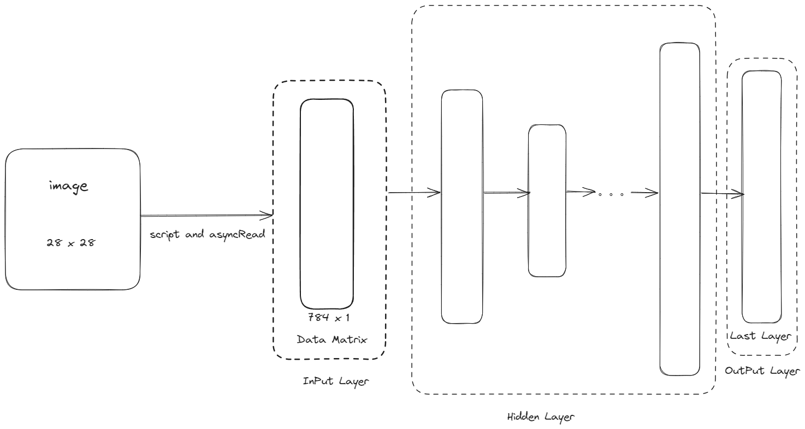
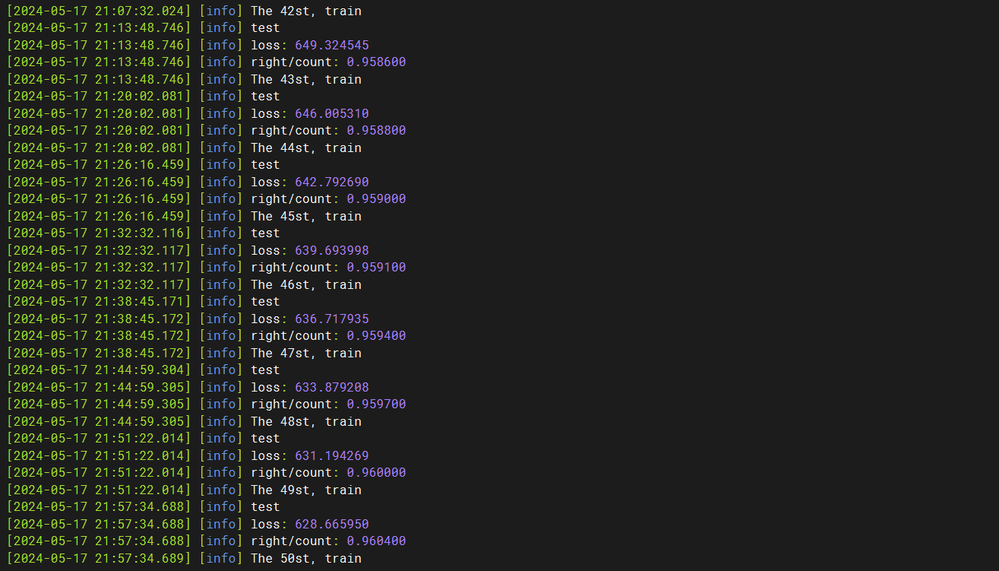
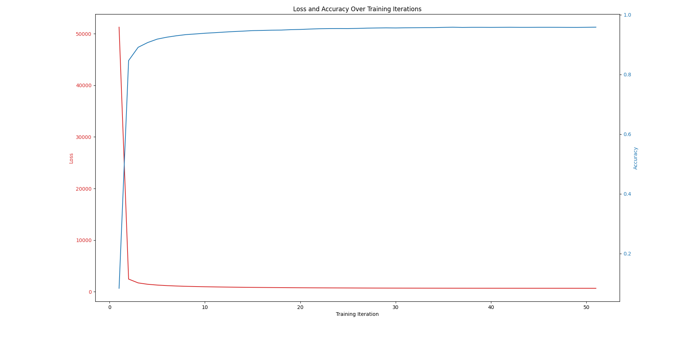

# NN (Neural Network) MNIST


- This project implements a NN(Neural Network) to classify handwritten digits from the MNIST dataset.

# Use

- clone the project and add the sub-model(spdlog)

```shell
git clone https://github.com/Jungle430/NN_MNIST.git
git submodule init
git submodule update
```

# Design idea



- prepare the data

```shell
cd script
python3 read_mnist.py <train_data_set_size(0~60000)> <test_data_set_size(0~10000)>
```

- You can safely set the scale of large datasets because the asynchronous data reading feature has been implemented. Therefore, you don't need to worry about memory overflow issues.

- Set the scale of the neural network

```c++
NeuralNetwork<long double, 4> neural_network(
      MNIST::IMAGE_DOMAIN, {{NN::DEFAULT_NODE_SIZE, "Sigmoid"},
                      {NN::DEFAULT_NODE_SIZE, "Sigmoid"},
                      {NN::DEFAULT_NODE_SIZE, "Sigmoid"},
                      {MNIST::NUMBER_SIZE, "Sigmoid"}});
```

- The last layer is output layer, so the size must equal to kind of MNIST number(0~9)

- Two active function can be chosen
    - Sigmoid
    - ReLU

- The number of the layers must equal with N (`NeuralNetwork<dtype, N>`)

- make the program

```shell
mkdir build
cd build
cmake ..
make
```

- Then you can train and test your Neural Network Model!

# Attetion

- This neural network is written using C++'s STL library without any special optimizations, so its computational efficiency is much lower compared to PyTorch. The code for this neural network is primarily intended for understanding the structure of neural networks.

# Training effect

- network scale: $3 \times 100$



# Picture

- Remove irrelevant information from the log (like nohup), modify the log file path in `picture.py`, Then run the picture script

```shell
cd script
python3 picture.py
```



# Thanks

- Thanks the the open source project [spdlog 1.14.1](https://github.com/gabime/spdlog/tree/27cb4c76708608465c413f6d0e6b8d99a4d84302)